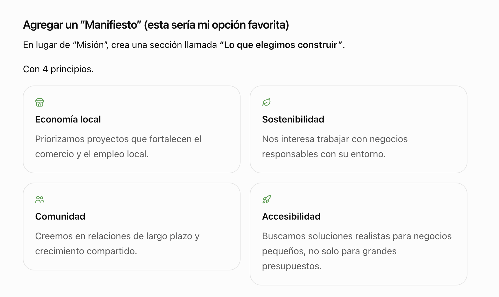

# RS Studio – Local Impact and Shared Growth Brand Positioning

## Purpose

Integrate RS Studio’s social mission into the brand narrative in a natural and authentic way, without turning it into a traditional “corporate social responsibility” section.

The core idea is to make this mission part of the **company’s value proposition**: helping small businesses, local entrepreneurs, community projects, and environmentally responsible initiatives grow through technology, design, and automation.

No design changes are proposed. The visual structure of the website remains unchanged. This document only defines **brand positioning, messaging, and copy direction**.

---

# Brand positioning

RS Studio does not simply build websites and software. It builds digital tools that help small businesses compete, grow, and strengthen their local communities.

### Core positioning statement

> When a small business grows, local families, jobs, and communities grow with it.

Technology is presented as a tool for strengthening local economies and impact-driven businesses.

---

# Primary message

## Main version

> We grow alongside the people building stronger communities.

## Alternative versions

> Technology should not be a privilege reserved for large companies.

> We build digital tools for businesses that strengthen their communities.

> When your business grows, our community grows too.

---

# Narrative direction

The website should communicate that RS Studio intentionally chooses to work with businesses and organizations that create local value.

Suggested narrative:

> We have seen too many great local businesses struggle because they lacked the digital tools, online presence, or automation needed to compete. RS Studio exists to help close that gap.

This creates a more authentic and memorable story than a generic corporate mission statement.

---

# “Grow together” messaging

Suggested copy:

> RS Studio was built on a simple belief: technology should not be a privilege reserved for large companies.

> We help small businesses, local entrepreneurs, community initiatives, and environmentally responsible projects grow through thoughtful digital solutions.

> When your business grows, our community grows too.

---

# Brand manifesto

Instead of presenting a traditional mission statement, communicate a clear set of principles.

## What we choose to build

### Local economies

We prioritize projects that strengthen local businesses, entrepreneurship, and regional economic growth.

### Sustainability

We actively seek opportunities to work with businesses that care about their environmental and social impact.

### Community

We believe long-term relationships create stronger businesses and stronger communities.

### Accessibility

We build practical, scalable technology solutions that are accessible to small businesses, not only large organizations.

For implementation, check the wireframe or mockup created at 

when you want to implement this, make sure you use styles similar to the ones in src/components/Services.astro

---

# RS Impact

Create an internal brand concept that represents RS Studio’s commitment to local and community impact.

The goal is not charitable positioning; the goal is **shared growth**.

Potential focus areas:

- family-owned businesses
- local retailers
- cooperatives
- sustainable businesses
- cultural initiatives
- community organizations

Potential forms of support:

- digital strategy
- website development
- automation
- technology consulting
- operational optimization

The emphasis should always be on **collaboration and long-term growth**, not charity.

---

# Portfolio positioning

When relevant projects exist, highlight them as businesses creating local impact.

Possible categories:

- local business
- family business
- environmental impact
- circular economy
- education
- healthcare
- community

This reinforces the brand positioning through real work rather than claims.

---

# Impact metrics

In the future, consider tracking measurable impact.

Examples:

- local businesses supported
- sustainable projects launched
- automation systems implemented
- mentoring hours
- long-term client partnerships

Only publish metrics that can be verified.

---

# Call-to-action direction

Replace generic calls-to-action with messaging aligned with the mission.

Examples:

> Let’s build something that grows your business and your community.

> If you’re building a business with local impact, we’d love to help you scale it.

> Let’s explore how technology can strengthen your project.

---

# Future impact page

Potential route:

`/impact`

Purpose:

Explain why RS Studio prioritizes local businesses and impact-driven organizations.

The tone should feel personal and authentic rather than corporate.

---

# Editorial principle

The messaging should always communicate partnership.

Avoid language that positions RS Studio as a “savior” of small businesses.

Prefer language such as:

- collaborate
- build together
- strengthen
- support growth
- grow together
- long-term partnership
- local impact

The central idea is that **RS Studio grows with its clients, not above them**.

---

# Guiding statement

The phrase that captures the entire brand direction is:

> We grow together.

This should serve as the core narrative across the website, portfolio, social media, and future communications.